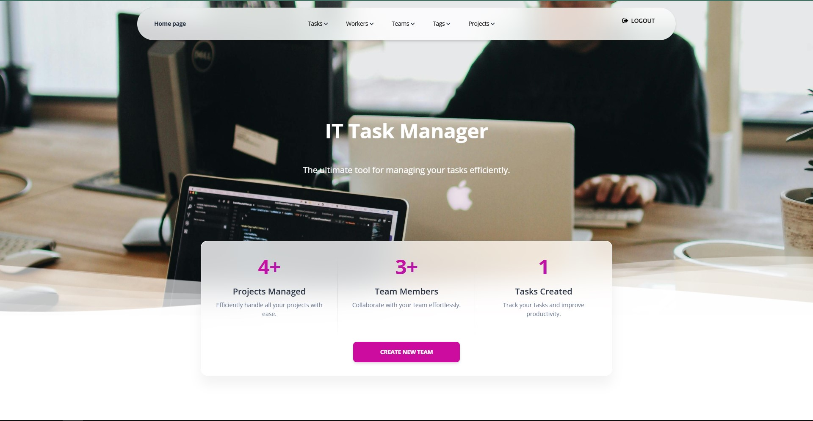

# IT Task Manager 

A powerful and efficient Django-based tool for managing tasks.

## Table of Contents

1. [About the Project](#about-the-project)
2. [Features](#features)
    - [Core Features](#core-features)
    - [User Experience](#user-experience)
    - [Technical Features](#technical-features)
    - [Advanced Features (Planned for Future Releases)](#advanced-features-planned-for-future-releases)
3. [Getting Started](#getting-started)
    - [Prerequisites](#prerequisites)
    - [Installation](#installation)
4. [Usage](#usage)
5. [Demo](#demo)
6. [License](#license)
7. [Contact](#contact)

---

## About the Project

**IT Task Manager** is a web application built with Django to streamline task management. It allows users to create, update, and manage their tasks with ease through a clean and intuitive interface.

---

## Features

IT Task Manager offers a range of features to make task management seamless and efficient:

### Core Features
- **Task Management**: Create, update, and delete tasks with ease.
- **Prioritization**: Assign priority levels to tasks (e.g., Low, Medium, High).
- **Deadlines**: Set deadlines to keep your tasks on track.
- **Task Status**: Mark tasks as "In Progress," "Completed," or "Pending."
  
### User Experience
- **Clean Interface**: User-friendly and intuitive design for quick navigation.
- **Search Functionality**: Find tasks quickly by name or other parameters (coming soon).
- **Mobile-Responsive Design**: Fully responsive interface for use on any device.

### Technical Features
- **Secure Authentication**: User accounts with secure login (Django authentication system).
- **Scalable Architecture**: Built with Django to support growing projects.
- **Customizable**: Easily extendable to fit personal or team workflows.

### Advanced Features (Planned for Future Releases)
- **User Collaboration**: Assign tasks to multiple users and track progress collaboratively.
- **Notifications**: Receive email or push notifications for upcoming deadlines.
- **Reports & Analytics**: Generate reports to analyze task completion trends.
- **Integration**: Sync with external tools like Google Calendar or Slack.

---

## Getting Started

Follow these steps to set up the project locally.

### Prerequisites

- Python 3.8 or newer
- `pip` for managing Python packages
- `git` for cloning the repository

### Installation

1. Clone the repository:

    ```bash
    git clone https://github.com/mgoryn/it-task-manager
    ```

2. Navigate to the project directory:

    ```bash
    cd it-task-manager
    ```

3. Set up a virtual environment:

    ```bash
    python3 -m venv venv
    source venv/bin/activate  # On Windows, use "venv\Scripts\activate"
    ```

4. Install the required dependencies:

    ```bash
    pip install -r requirements.txt
    ```

5. Apply the database migrations:

    ```bash
    python manage.py migrate
    ```

6. Run the development server:

    ```bash
    python manage.py runserver
    ```

7. Open your browser and visit:

    ```
    http://127.0.0.1:8000
    ```

---

## Usage

- Navigate through the application to add, edit, or delete tasks.
- Customize the app further for personal or team use cases by modifying the source code.

---

## Demo

### Web Application Interface

Below is a snapshot of the interface:



Render - [Render.WebService](https://dashboard.render.com/web/srv-csubor52ng1s73cg1o60/events)

Check out the live demo here: [IT Task Manager](https://it-task-manager-fwgf.onrender.com)

- Enter this example data to test my project - 

- Sign in: 

- Username: test
- Password: test123

---

## License

This project is licensed under the [MIT License](LICENSE).

---

## Contact

For questions or suggestions, feel free to reach out:

- **Author:** [Mykhailo](https://github.com/mgoryn)
- **Project Link:** [GitHub Repository](https://github.com/mgoryn/it-task-manager)

---

We hope this project helps streamline your task management!
